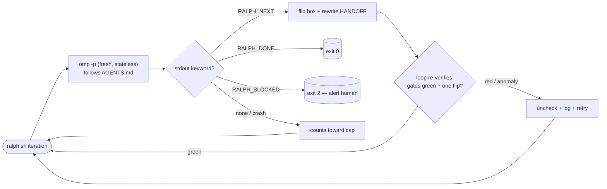

# Ralph Loop

A file-driven, **stateless** execution loop that drives `omp -p` **one task per
iteration** against a project. Each iteration is a *fresh* `omp` process: it
reads its instructions + status + handoff from files on disk, does exactly one
task, writes a handoff, and exits. State lives in files (crash-survivable,
inspectable, zero IPC) — not in a long-lived session.

```
spawn → read protocol + status + handoff → do ONE task → flip its box →
rewrite handoff → emit RALPH_NEXT → exit → repeat
```



---

## Quick start

```bash
# 1. Drop this repo next to (or inside) the project you want to drive.
# 2. Tell the loop where the project is and what its gates are, then run:
RALPH_PROJECT="$HOME/code/my-app" \
RALPH_GATE_CMD="npm test && npm run typecheck" \
./ralph.sh
```

Watch progress live (regenerated after every iteration):

```bash
tail -f runs/<timestamp>/analytics/summary.md
```

Before your first run you decompose the work into tasks (see
[§ Writing tasks](#writing-tasks)) and register them in `PROCESS.md`. The loop
**never decomposes** — it only executes.

### Environment variables

| Var | Default | Meaning |
|---|---|---|
| `RALPH_PROJECT` | parent of `ralph.sh` | the work target (code changes land here; `--cwd` for the spawn) |
| `RALPH_MAX_ITERS` | `50` | hard cap on iterations; hitting it exits `3` (runaway guard) |
| `RALPH_OMP` | `omp` | the omp binary to invoke |
| `RALPH_MODE` | `text` | `text` (default) or `json` — `json` spawns omp under `--mode=json` so the loop can account per-iteration tokens (NDJSON logs; keyword scan stays line-anchored) |
| `RALPH_VERIFY_GATES` | `1` | when `1`, the loop re-runs the gate command after each iteration and unchecks the box on red (an external check the agent self-report cannot provide); `0` trusts the agent |
| `RALPH_GATE_CMD` | `npm test && npm run typecheck` | the project's quality gates, run as one shell command. Used by the loop's verification re-run AND injected into the spawned agent's prompt (AGENTS.md step 5). Override per stack: `cargo test`, `pytest -q`, `go build ./... && go test ./...`. An empty value disables the loop-level re-run. |
| `RALPH_BAR_WIDTH` | `20` | ASCII bar width in the analytics summary |

---

## Two planes

- **Control plane** = the directory containing `ralph.sh` (`$DIR`). Protocol,
  status, handoff, knowledge, task specs, logs. The spawned agent reads/writes
  these by **absolute** `CONTROL_DIR/...` path.
- **Work plane** = `$RALPH_PROJECT` (default: the *parent* of this repo, i.e.
  the project it ships next to). The spawn runs with `--cwd "$PROJECT"`; all
  code changes land there. Git-churn analytics diff against that repo.

Keeping them separate means the control plane is **namespaced** — it never
collides with a project's own `AGENTS.md` — while still sitting next to the
project it drives.

### Layout

```
jz-ralph-loop/
  ralph.sh         # the bash loop driver
  analytics.sh     # renders runs/<plan>/analytics/summary.md
  AGENTS.md        # per-iteration protocol the spawned omp reads first (THE contract)
  PROCESS.md       # status only: one checkbox per task, grouped by phase
  HANDOFF.md       # transient; REWRITTEN each iteration (in-flight state)
  KNOWLEDGE.md     # durable; append-only pitfall ledger (kept <~30 lines)
  tasks/
    _TEMPLATE.md   # blank task template
    0NN-<slug>.md  # immutable task specs (zero-padded → dependency order)
  .gitignore       # ignores runs/ and scratch files
  runs/            # created at runtime, gitignored
    RALPH.log              # master: one line per event across ALL plans
    <UTC-timestamp>/       # one dir per ralph.sh invocation ("plan"/"run")
      timeline.csv         # per-iteration metrics
      001.log, 002.log, …  # each iteration's omp stdout+stderr
      .base_head           # git HEAD captured at loop start (churn baseline)
      analytics/summary.md # rendered dashboard
```

---

## How one iteration works (`ralph.sh`)

1. Pre-flight: asserts `AGENTS.md`, `PROCESS.md`, `HANDOFF.md`, `KNOWLEDGE.md`
   exist (exit `1` if any is missing). Creates a fresh `runs/<UTC>/` plan dir,
   snapshots the project's `HEAD` as the churn baseline, writes the
   `timeline.csv` header.
2. For each iteration (up to `RALPH_MAX_ITERS`):
   - Copies `PROCESS.md` to `.process.N.before` (to detect which box flips).
   - Spawns **one** fresh omp:
     ```bash
     omp -p --no-session --auto-approve --cwd "$PROJECT" \
       "You are ONE iteration of a Ralph loop. CONTROL_DIR is $DIR. \
        Read and follow the protocol at $DIR/AGENTS.md exactly. …"
     ```
   - Scans the iteration log for a keyword (first match wins, **BLOCKED** has
     priority) → records the outcome.
   - Diffs `PROCESS.md` before/after to derive the `task_id` + `phase` of the
     flipped box; computes cumulative git churn; appends a `timeline.csv` row;
     refreshes the analytics summary (non-fatal).
   - Acts on the outcome (see contract below).

### Keyword contract (agent prints one, alone on its own line)

| Agent emits | Loop action | `ralph.sh` exit |
|---|---|---|
| `RALPH_NEXT` | completed one task → loop again | — |
| `RALPH_DONE` | no unchecked tasks remain → stop | `0` |
| `RALPH_BLOCKED` | stuck / needs a human → stop, alert | `2` |
| *(none / crash)* | failed iteration; counts toward the cap | `3` if the cap is hit |

`RALPH_DONE` and the "no unchecked box" condition are redundant on purpose (belt
and suspenders). Hitting `RALPH_MAX_ITERS` exits `3` — the runaway guard.

### The per-iteration protocol (see `AGENTS.md` for the binding version)

1. Read `PROCESS.md` → first `- [ ]` task. If none → rewrite a final
   `HANDOFF.md`, print `RALPH_DONE`.
2. Read that task spec fully; read `HANDOFF.md` + `KNOWLEDGE.md`.
3. Implement **one** task (TDD where the task implies it; scope strictly).
   - Dependency still unchecked, or genuinely blocked → note in `HANDOFF.md`,
     print `RALPH_BLOCKED`.
   - Pitfall worth keeping → **append** one short line to `KNOWLEDGE.md`.
4. Run the quality gates. GREEN is required to finalize; RED → fix or
   `RALPH_BLOCKED` (never commit red, never flip a red box).
5. Flip **only this** box `- [ ] → - [x]`, **rewrite** `HANDOFF.md`, then
   `git add -A && git commit` — one atomic, revertable commit per task
   (commit-on-green).
6. Print `RALPH_NEXT`.

---

## Control files — who may change what

| File | Mutability | Content |
|---|---|---|
| task spec (`tasks/0NN-*.md`) | **immutable at runtime** | Goal / Context / Acceptance / Notes |
| `PROCESS.md` | status only | one `- [ ]`/`- [x]` per task, grouped by phase |
| `HANDOFF.md` | **rewritten** each iteration | transient in-flight state |
| `KNOWLEDGE.md` | **append-only** | durable pitfall ledger (prune past ~30 lines) |

Promotion rule: if a `HANDOFF.md` note keeps mattering across iterations, promote
it into `KNOWLEDGE.md`. `HANDOFF.md` stays short *because* it is not history.

---

## Writing tasks

The loop **never decomposes** — it only executes. Break work into phases → tasks
**before** running, each sized ~30 min–2 h for a junior/mid dev, self-contained,
TDD-where-applicable.

- Name: `0NN-<slug>.md`, **zero-padded** so lexicographic order is a valid
  dependency order.
- Frontmatter: `id`, `phase`, `depends_on: [...]`, `estimate: ~45m`.
- Body: `## Goal` · `## Context` · `## Acceptance criteria` (`- [ ]` items) ·
  `## Notes` — copy `tasks/_TEMPLATE.md`.
- Register each task as one line in `PROCESS.md` under its phase:
  `- [ ] 0NN-<slug> → tasks/0NN-<slug>.md`.

`PROCESS.md` order *is* execution order — the loop always takes the first
`- [ ]`. Reorder only when decomposing, never at runtime.

---

## Analytics

Every `ralph.sh` invocation creates `runs/<UTC-timestamp>/`. After each
iteration the driver appends a `timeline.csv` row and regenerates
`analytics/summary.md` (a live dashboard — tail it to watch progress).

`timeline.csv` columns:
`iter,start_iso,end_iso,dur_s,outcome,task_id,phase,nfiles,ins,del,tokens`

- `task_id` / `phase` — derived by diffing `PROCESS.md` before → after the
  iteration (whichever box flipped). HTML-comment blocks in `PROCESS.md` are
  skipped, so commented-out examples aren't counted.
- `nfiles` / `ins` / `del` — cumulative `git diff --numstat` vs the `HEAD`
  captured at loop start; the summary computes true per-iteration deltas.
- `tokens` — best-effort. `omp -p` in default **text** mode emits no usage line,
  so the column stays empty and the summary omits the tokens line. Set
  `RALPH_MODE=json` to spawn under `--mode=json`; the loop then sums
  `usage.totalTokens` across the iteration's assistant messages and populates the
  column (logs become NDJSON; the keyword scan stays line-anchored, applied to the
  extracted assistant text).

`analytics.sh` is also usable standalone:

```bash
./analytics.sh <plan_dir> <control_dir> <project>
```

---

## Verification model and upgrade path

Each iteration runs the project's **quality gates** (`RALPH_GATE_CMD`) inside the
agent, and a task may flip its box + commit only when they are **green**
(commit-on-green). RED → fix in-iteration or `RALPH_BLOCKED`; the box is never
flipped and nothing is committed on red. This makes "green" an objective
precondition (exit codes). On top of the agent's own gate run, the **loop itself**
independently verifies every non-`BLOCKED` iteration:

- **gate re-run + uncheck on red** (`RALPH_VERIFY_GATES=1`, default): after each
  iteration the loop re-runs `RALPH_GATE_CMD` in the project; on red it restores
  `PROCESS.md` from the pre-iteration snapshot (un-checking the box the agent just
  flipped) and records `outcome=RED`, so a broken or dishonest iteration cannot
  leave a checked box — the task retries next iteration. Set
  `RALPH_VERIFY_GATES=0` to trust the agent self-report (faster, weaker).
- **exactly-one-box-flipped assertion**: `NEXT` must flip exactly one box,
  `DONE`/`NONE` must flip zero; any other count records `outcome=ANOMALY`,
  restores `PROCESS.md`, and retries. (`BLOCKED` exits 2 regardless; a `BLOCKED`
  agent that nonetheless flipped still has its box restored.)
- **`--mode json` token accounting** (`RALPH_MODE=json`, opt-in): spawns omp under
  `--mode=json` and sums `usage.totalTokens` per iteration into `timeline.csv`.
  The default `text` mode cannot (omp emits no usage line); the column stays empty.

The agent's commit on a rejected iteration is **not** auto-reverted — it stays in
git as a forensic record while the box is un-checked for retry. `RALPH_MAX_ITERS`
bounds the retry loop: a persistently-broken task hits the cap → `exit 3`.

Other guardrails: a short imperative `AGENTS.md` + strict keyword contract
mitigate drift; `RALPH_MAX_ITERS` + `RALPH_BLOCKED` bound token spend; v1 is
serial by design (one task, one omp process); commit-on-green gives a clean,
revertable checkpoint per task, so `git log --oneline` reads as a task ledger and
`git revert <sha>` undoes one.

---

## Troubleshooting

- **`exit 2` (BLOCKED)** — read the iteration log (`runs/<ts>/NNN.log`) and
  `HANDOFF.md`; the agent wrote what it needs. Unblock and re-run.
- **`exit 3` (cap hit)** — possible runaway or many failed (keyword-less)
  iterations. Skim the tail of `timeline.csv` (`outcome` column) and the recent
  logs; raise `RALPH_MAX_ITERS` only if progress is real.
- **Nothing happens / wrong project** — confirm `RALPH_PROJECT` (defaults to
  `ralph.sh`'s parent) and that the project is a git repo (churn is empty
  otherwise).
- **Wrong gates / wrong stack** — set `RALPH_GATE_CMD` to your project's verify
  command. The default assumes an npm/TypeScript project.
- **First iteration picks the wrong task** — `PROCESS.md` order *is* execution
  order; the loop always takes the first `- [ ]`. Reorder only when decomposing,
  never at runtime.

---

## Requirements

- `omp` (the [Oh My Pi](https://github.com/jimzord12) agent runner) on `PATH`,
  or pointed at by `RALPH_OMP`.
- `git` (churn analytics; also used by the agent's commit-on-green step).
- `jq` — only when `RALPH_MODE=json` (token accounting + keyword extraction from
  NDJSON logs). Not needed for the default text mode.
- `awk`, `date`, `diff`, `grep`, `sed` — standard POSIX/coreutils.

## Origin

Extracted and generalized from a loop that shipped inside another project, where
it drove a 28-task / 7-phase build to completion with one atomic commit per task.
The npm-specific gate assumption was lifted into `RALPH_GATE_CMD` so the same
driver works for any stack; the rest of the design is unchanged. Licensed MIT.
